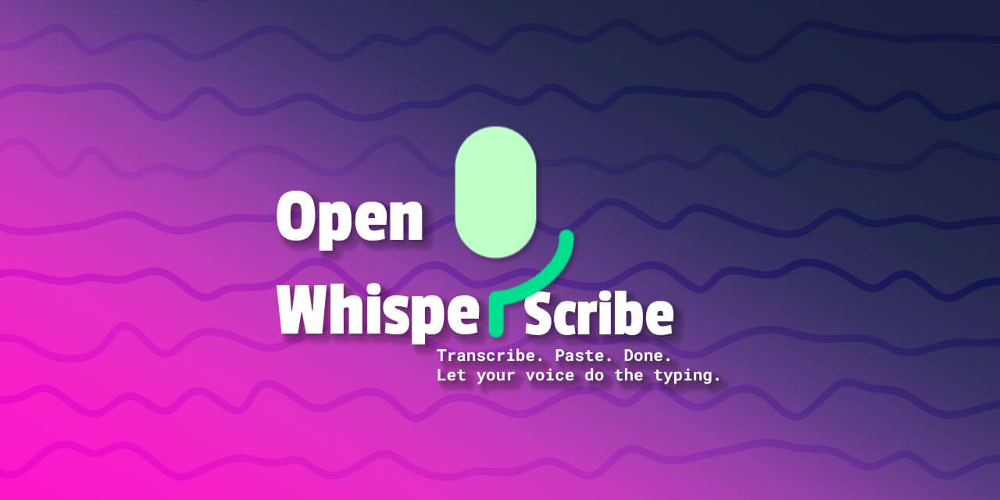

# Open WhisperScribe

> Transcribe. Paste. Done. Let your voice do the typing.



## Highlights

🎙️ **Speak Naturally**: Converts your voice into text effortlessly using advanced Whisper speech recognition.

⚡ **Instant Transcription**: Transcribes spoken words in real time, ready to paste anywhere.

📋 **Clipboard Integration**: Automatically copies the transcribed text to your clipboard for quick use.

💼 **For Everyone**: Ideal for professionals, creatives, students, and anyone who wants to save typing time.

🛠️ **Lightweight CLI Tool**: Easy to install and run from the command line without distractions.

✍️ **Boost Productivity**: Streamlines note-taking, writing, and communication by bridging speech and text seamlessly.

🌙 **Runs in Background**: Operates quietly without interrupting your workflow or demanding attention.

## Usage

### Prerequisites

- Python 3.8 or higher installed on your system.
- `pip` package manager.
- Tested on macOS, but it should also work on Windows and Linux since it is written in Python.

### Setup

1. Open your terminal and clone the repository:

   ```bash
   git clone https://github.com/yourusername/open-whisperscribe.git
   cd open-whisperscribe
   ```

2. Run the setup script to create a virtual environment and install dependencies:

   ```bash
   ./setup.sh
   ```

### Running the Application

1. Start the application:

   ```bash
   ./run.sh
   ```

   > **Note**: The app runs in the background, so you are free to close the terminal window if you want to.

2. Press and hold the hotkey combination `Option + Shift-Left` (or `Alt + Shift-Left` on Windows/Linux) to start recording your voice.

3. Release the hotkey to transcribe your speech and automatically copy the text to your clipboard.

### Stopping the Application

To stop the application, run:

```bash
./stop.sh
```

## License

This project is licensed under the Apache License 2.0.

See the [LICENSE.txt](./LICENSE.txt) file for the full license text.
