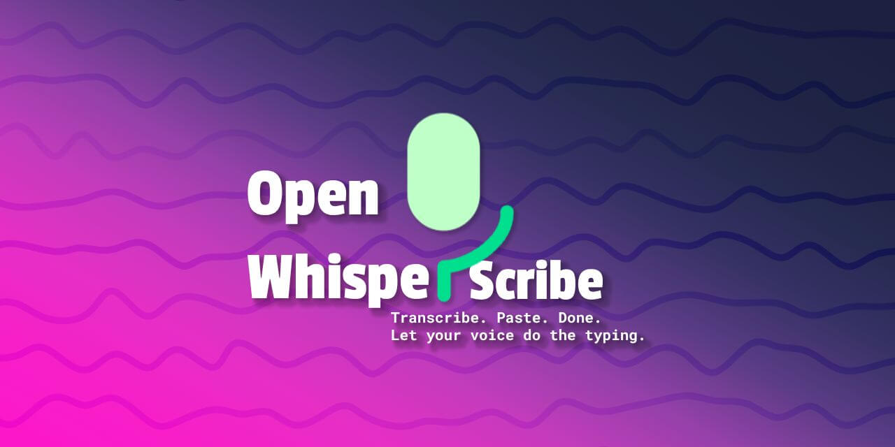

# Open WhisperScribe

> Transcribe. Paste. Done. Let your voice do the typing.

Open WhisperScribe is a lightweight and efficient tool that converts your voice into text using advanced OpenAI Whisper model's speech recognition. Designed for professionals, creatives, and students, it streamlines note-taking, writing, and communication by bridging speech and text seamlessly.

## Highlights

- 🎙️ **Speak Naturally**: Converts your voice into text effortlessly using advanced Whisper speech recognition.
- ⚡ **Instant Transcription**: Transcribes spoken words in real time, ready to paste anywhere.
- 📋 **Clipboard Integration**: Automatically copies the transcribed text to your clipboard for quick use.
- 💼 **For Everyone**: Ideal for anyone who wants to save typing time.
- 🛠️ **Lightweight CLI Tool**: Easy to install and run from the command line without distractions.
- ✍️ **Boost Productivity**: Streamlines note-taking, writing, and communication.
- 🌙 **Runs in Background**: Operates quietly without interrupting your workflow.

## Demo

<https://github.com/user-attachments/assets/0eed09df-5bbb-414a-9d69-c8edc59afe70>

## Instructions

- [Setup](./docs/setup.md)
- [Usage](./docs/usage.md)
- [How it works](./docs/how_it_works.md)

## License

This project is licensed under the Apache License 2.0.

See the [LICENSE.txt](./LICENSE.txt) file for the full license text.

---

[Credits](./docs/credits.md)
