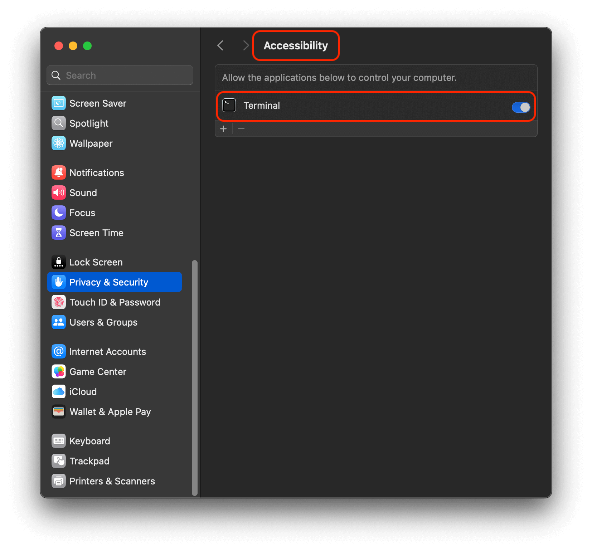
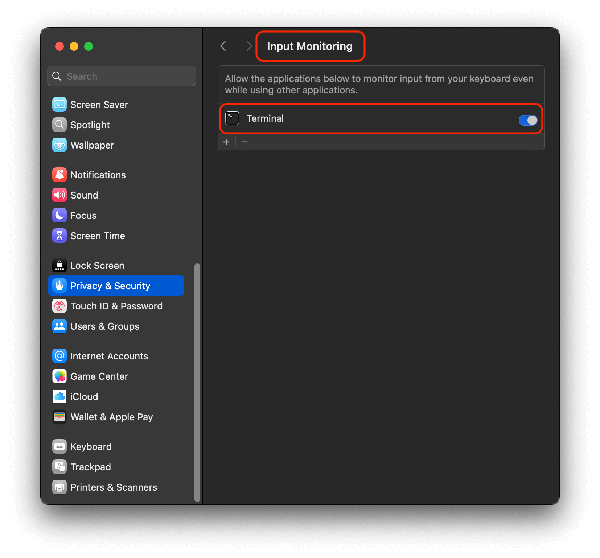
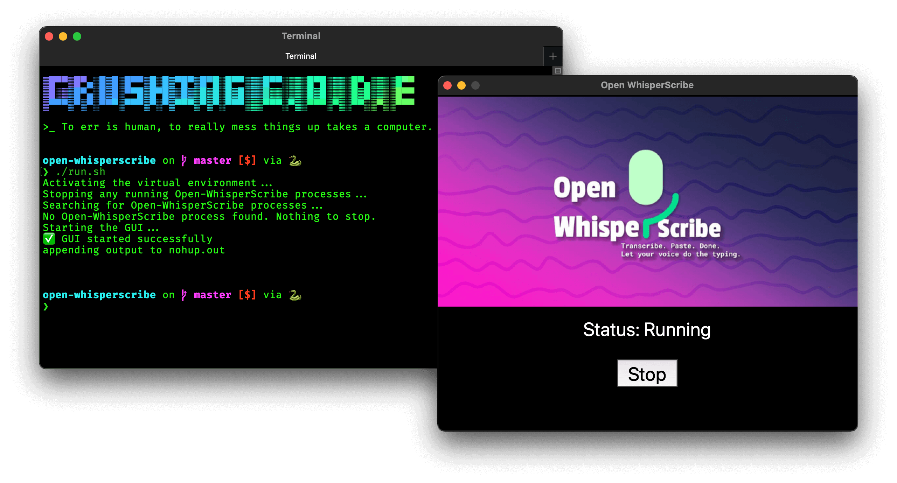

# Open WhisperScribe

> Transcribe. Paste. Done. Let your voice do the typing.

Open WhisperScribe is a lightweight and efficient tool that converts your voice into text using advanced OpenAI Whisper model's speech recognition. Designed for professionals, creatives, and students, it streamlines note-taking, writing, and communication by bridging speech and text seamlessly.


## Highlights

- 🎙️ **Speak Naturally**: Converts your voice into text effortlessly using advanced Whisper speech recognition.
- ⚡ **Instant Transcription**: Transcribes spoken words in real time, ready to paste anywhere.
- 📋 **Clipboard Integration**: Automatically copies the transcribed text to your clipboard for quick use.
- 💼 **For Everyone**: Ideal for anyone who wants to save typing time.
- 🛠️ **Lightweight CLI Tool**: Easy to install and run from the command line without distractions.
- ✍️ **Boost Productivity**: Streamlines note-taking, writing, and communication.
- 🌙 **Runs in Background**: Operates quietly without interrupting your workflow.

## Usage

### Prerequisites

- [Python 3.8 or higher](https://www.python.org/) installed on your system.
- [`pip` package manager](https://pip.pypa.io/en/stable/).
- [`brew` package manager](https://brew.sh/).
- Tested on macOS, but it should also work on Windows and Linux since it is written in Python.

### Setup

1. Open your terminal and clone the repository:

   ```bash
   git clone https://github.com/nisrulz/open-whisperscribe.git
   cd open-whisperscribe
   ```

2. Run the setup script to create a virtual environment, install dependencies, and configure permissions:

   ```bash
   ./setup.sh
   ```

   > The script will guide you through enabling the required permissions on macOS. Follow the on-screen instructions to proceed.
   > 

   #### Enabling Permissions on macOS

    To use Open WhisperScribe on macOS, grant the following permissions to your Terminal app:

   > **Note**: You need admin rights to modify these settings.

   1. **Accessibility**: Allow your Terminal app to control your computer.
      

   2. **Microphone**: Grant access to record audio.
      

   3. **Input Monitoring**: Enable monitoring of keyboard input.
      

### Running the Application

1. Start the application:

   ```bash
   ./run.sh
   ```

   

   Once the GUI loads, click "Start" to activate the hotkey functionality.

2. Place your cursor inside the application or text field where you want the transcribed text to appear.

3. Press and hold the hotkey combination `Option + Shift-Left` (or `Alt + Shift-Left` on Windows/Linux) to start recording your voice.

   > You can configure this hotkey combination. See the [Configure](#configure) section below for details.

4. Release the hotkey to transcribe your speech and automatically copy the text to your clipboard.

### Stopping the Application

To stop the application, you can:

1. Press the "Stop" button in the GUI.

   

2. Quit the GUI by clicking the "x" button on the top left corner.

   

3. Run the following script to stop all running instances:

   ```bash
   ./stop.sh
   ```

### Configure

Customize the application by modifying the `config.yaml` file located in the root directory. Below are some common configurations:

1. **Audio Settings**:

   - `sample_rate`: Adjust the audio sample rate (e.g., `16000` for 16kHz).
   - `audio_file`: Specify the name of the file where recorded audio will be saved.

2. **Logs**:

   - Logs are written to the `nohup.out` file by default when the application is run in the background using `./run.sh`.

3. **Hotkey Combination**:

   - The hotkey combination is defined in `src/hotkey_combination.py`. To change it, modify the `HOTKEY_COMBINATION` variable. For example:

     ```python
     HOTKEY_COMBINATION = {keyboard.Key.ctrl, keyboard.Key.space}
     ```

   - Use `keyboard.Key` and then type `.` for autocompletion and to avoid errors.

4. **Whisper Model**:

   - `model`: Specify the Whisper model to use. Possible values are `tiny`, `base`, `small`, `medium`, and `large`.
   - The model is downloaded and cached automatically when you run the application for the first time.

After making changes, restart the application for the updates to take effect:

```bash
./run.sh
```

## Credits

This project makes use of the following:

- [Whisper Model by OpenAI](https://openai.com/research/whisper): A state-of-the-art speech recognition model.
- [pynput](https://pynput.readthedocs.io/en/latest/): A library for controlling and monitoring input devices.
- [pyperclip](https://github.com/asweigart/pyperclip): A cross-platform Python module for clipboard operations.
- [pyautogui](https://pyautogui.readthedocs.io/en/latest/): A library for programmatically controlling the mouse and keyboard.
- [openai-whisper](https://github.com/openai/whisper): The official Python package for the Whisper model.
- [sounddevice](https://python-sounddevice.readthedocs.io/): A library for recording and playing back audio in real time.
- [numpy](https://numpy.org/): A fundamental package for scientific computing with Python.
- [scipy](https://scipy.org/): A library for mathematics, science, and engineering.
- [pillow](https://python-pillow.org/): A library for image processing in Python.
- [pyyaml](https://pyyaml.org/): A YAML parser and emitter for Python.
- [python-tk](https://wiki.python.org/moin/TkInter): A GUI toolkit for building graphical user interfaces in Python.
- [Logo Icon](https://www.svgrepo.com/svg/404638/mic-microphone-record-sound): From SVG Repo.

## License

This project is licensed under the Apache License 2.0.

See the [LICENSE.txt](./LICENSE.txt) file for the full license text.
