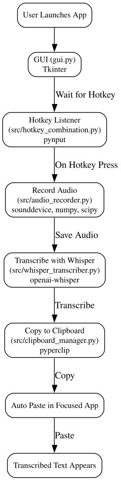

# How it works

1. The application starts when the user launches the app, which loads the GUI defined in `gui.py`. The GUI is built with [**Tkinter**](https://docs.python.org/3/library/tkinter.html) and displays the main interface.
2. The GUI sets up a hotkey listener, configured in `src/hotkey_combination.py`. The hotkey functionality is implemented using the [**pynput**](https://pypi.org/project/pynput/) library.
3. When the user presses the hotkey, the app records audio using code in `src/audio_recorder.py`. Audio recording is handled by the [**sounddevice**](https://pypi.org/project/sounddevice/) library, with data processing by [**numpy**](https://numpy.org/) and [**scipy**](https://scipy.org/).
4. The recorded audio is transcribed into text using the Whisper model via faster-whisper, called from `src/transcriber.py`. This step uses the [**faster-whisper**](https://github.com/SYSTRAN/faster-whisper) Python package (which internally uses the [**Whisper Model by OpenAI**](https://github.com/openai/whisper) with CTranslate2 for improved performance).
5. The transcribed text is copied to the clipboard by code in `src/clipboard_manager.py`, which uses the [**pyperclip**](https://pypi.org/project/pyperclip/) library for clipboard operations.
6. The tool automatically pastes the copied transcribed text at the currently focused app window where the cursor is.

## Privacy and Data Retention

Open-WhisperScribe is a **local-only application**, meaning all processing happens on your device. No data is sent to external servers, ensuring complete privacy. Below are details about data retention:

1. **Recordings**:
   - Recorded audio is saved as the name of the file defined in `config.yaml` under the `audio_file` key (default is `output.wav`) in the root directory of the application.
   - This file is overwritten each time a new recording is made.
   - If you wish to retain a recording, make a copy of the file before starting a new recording.

2. **Logs**:
   - Logs are written to the `nohup.out` file in the root directory.
   - This file contains information about the application's runtime behavior and is useful for debugging.
   - You can delete this file at any time without affecting the application's functionality.
