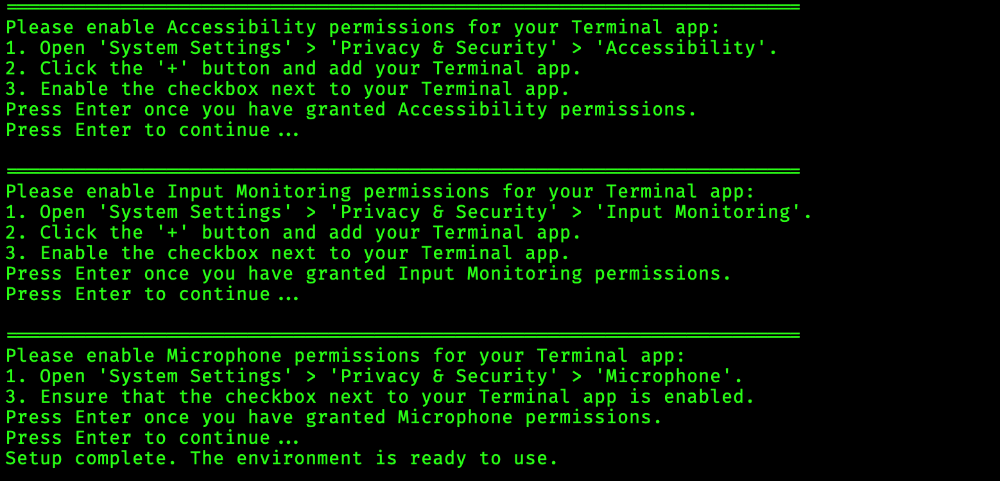

# Setting up the dependencies and permissions

## Prerequisites

- [Python 3.8 or higher](https://www.python.org/) installed on your system.
- [`pip` package manager](https://pip.pypa.io/en/stable/).
- [`brew` package manager](https://brew.sh/).
- Tested on macOS, but it should also work on Windows and Linux since it is written in Python.

## Setup

1. Open your terminal and clone the repository:

   ```bash
   git clone https://github.com/nisrulz/open-whisperscribe.git
   cd open-whisperscribe
   ```

2. Run the setup script to create a virtual environment, install dependencies, and configure permissions:

   ```bash
   ./setup.sh
   ```

   > The script will guide you through enabling the required permissions on macOS. Follow the on-screen instructions to proceed.
   > 

### Enabling Permissions on macOS

To use Open WhisperScribe on macOS, grant the following permissions to your Terminal app:

> **Note**: You need admin rights to modify these settings.

1. **Accessibility**: Allow your Terminal app to control your computer.
    

2. **Input Monitoring**: Enable monitoring of keyboard input. i.e HotKey press detection
    

3. **Microphone**: Grant access to record audio.
    
